<p align="center">
  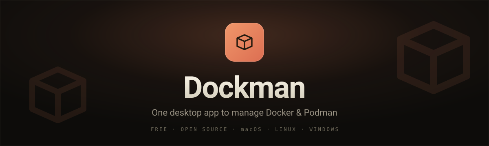
</p>

<p align="center">
  <a href="https://github.com/AbyAbyss/dockman/actions/workflows/ci.yml"></a>
  
  
  
  
  
  <a href="LICENSE"></a>
  
</p>

<p align="center">
  A fast, native desktop app for managing <b>Docker</b> and <b>Podman</b> side by side —<br>
  containers, images, volumes, networks, builds and runtimes, all in one place.
</p>

<p align="center">
  <a href="#features">Features</a> &nbsp;·&nbsp;
  <a href="#download">Download</a> &nbsp;·&nbsp;
  <a href="#screenshots">Screenshots</a> &nbsp;·&nbsp;
  <a href="#development">Development</a> &nbsp;·&nbsp;
  <a href="#releasing">Releasing</a>
</p>

---

> [!NOTE]
> **Dockman is under active development — but it works.** The core features are usable today; expect rough edges, fast-moving changes, and the occasional bug. Issues, ideas and stars are very welcome.

<p align="center">
  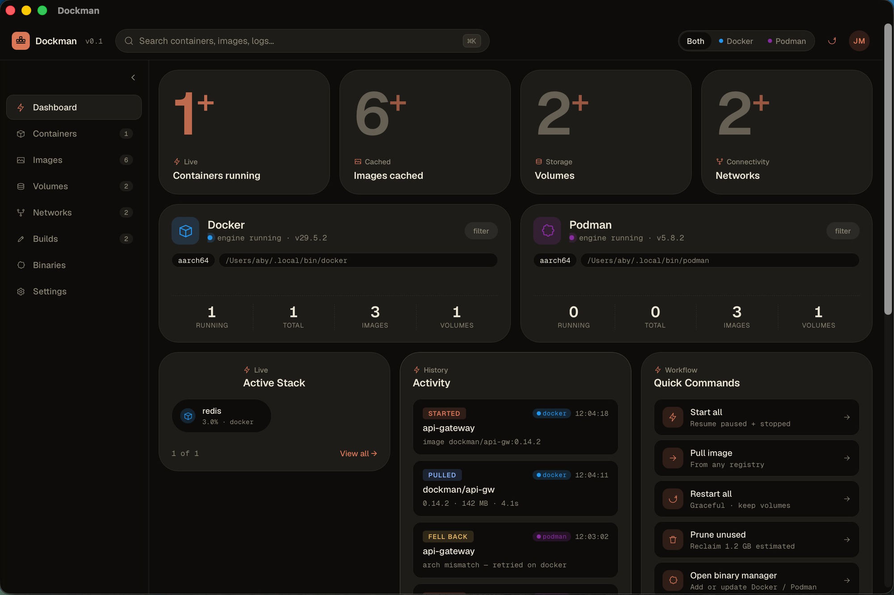
</p>

## ✨ Highlights

- 🐳 &nbsp;**Docker _and_ Podman, together** — drive both runtimes from one window, or filter to just one. Dockman can even retry on Docker when a Podman run hits an architecture mismatch.
- ⚡ &nbsp;**Truly native** — built with [Tauri](https://tauri.app): a small, fast binary with no bundled browser and none of the Electron bloat.
- 🧭 &nbsp;**Everything in one place** — containers, images, volumes, networks, builds, and the runtime binaries themselves.
- 🆓 &nbsp;**Free and open source** — MIT licensed. No account, no paywall, telemetry off by default.
- 💻 &nbsp;**Cross-platform** — macOS, Linux and Windows from a single codebase.

<a id="features"></a>

## 🧩 Features

| | |
| --- | --- |
| 📊 **Dashboard** | Live overview — running containers, cached images, volumes and networks; twin Docker / Podman engine cards; an activity feed and one-click quick commands. |
| 📦 **Containers** | Filterable, groupable table with start / stop / pause / restart / remove, plus the **Run Container** composer: image presets, name, runtime, port / env / volume mappings and a command override. |
| ⌨️ **Built-in shell** | Open an interactive terminal into any running container, switch between `sh` and `bash`, and walk command history with the arrow keys. |
| 🖼️ **Images** | Browse the local library, pull from any registry, see a storage breakdown, prune the unused, review top registries. |
| 💾 **Volumes** | Usage and reclaimable space, active bind mounts, and scheduled backup snapshots. |
| 🌐 **Networks** | A topology map of what's attached to what, plus live inbound / outbound bandwidth telemetry. |
| 🔨 **Builds** | Start image builds with layer caching, follow a build history, and inspect the layer waterfall. |
| ⚙️ **Binaries** | Install, update and switch between Docker and Podman CLI versions, with a setup checklist. |
| 🎛️ **Settings** | Pick the active runtime, tune engine resources, and toggle capabilities like Compose v2, BuildKit and Rosetta. |

> 💡 Plus the little things: an animated **scaffolding loader** while images pull, a `⌘K` **search** across containers, images and logs, and a clean **bento-grid** interface.

<a id="download"></a>

## 📥 Download

Grab the latest installer for your platform from the [**Releases**](https://github.com/AbyAbyss/dockman/releases) page:

| Platform | Installer |
| --- | --- |
| 🍎 macOS (Apple Silicon & Intel) | `.dmg` |
| 🪟 Windows | `.msi` / `.exe` |
| 🐧 Linux | `.AppImage` / `.deb` |

> [!IMPORTANT]
> Builds are currently **unsigned**. On first launch:
> - **macOS** — right-click the app → **Open**, then confirm.
> - **Windows** — on the SmartScreen prompt, choose **More info → Run anyway**.

<a id="screenshots"></a>

## 📸 Screenshots

<div align="center">

<table>
  <tr>
    <td align="center">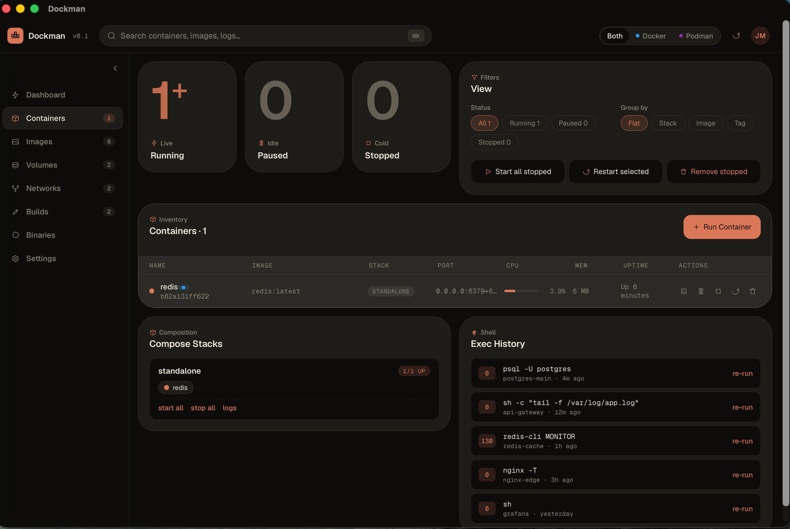<br><sub><b>Containers</b></sub></td>
    <td align="center">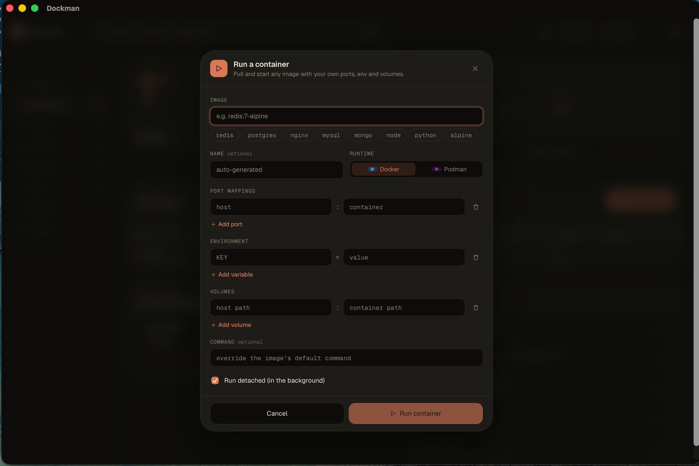<br><sub><b>Run Container</b></sub></td>
    <td align="center">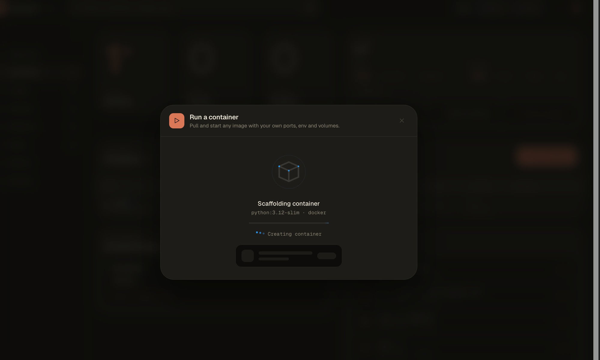<br><sub><b>Scaffolding loader</b></sub></td>
  </tr>
  <tr>
    <td align="center">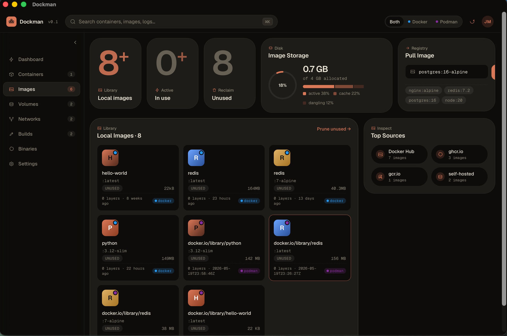<br><sub><b>Images</b></sub></td>
    <td align="center">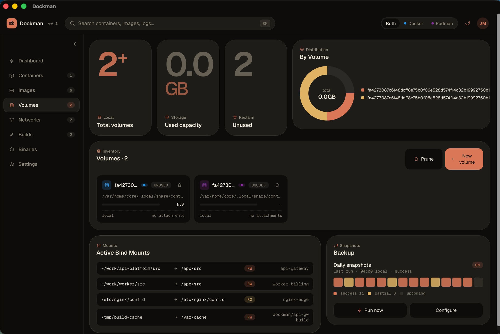<br><sub><b>Volumes</b></sub></td>
    <td align="center">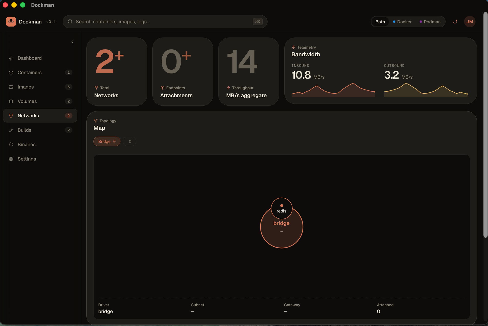<br><sub><b>Networks</b></sub></td>
  </tr>
  <tr>
    <td align="center">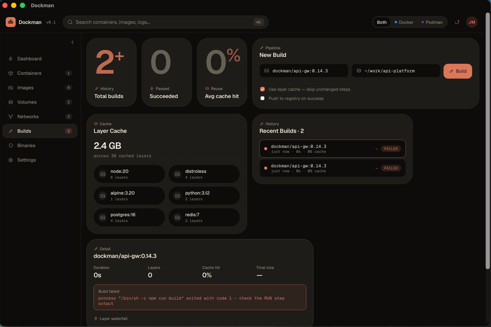<br><sub><b>Builds</b></sub></td>
    <td align="center">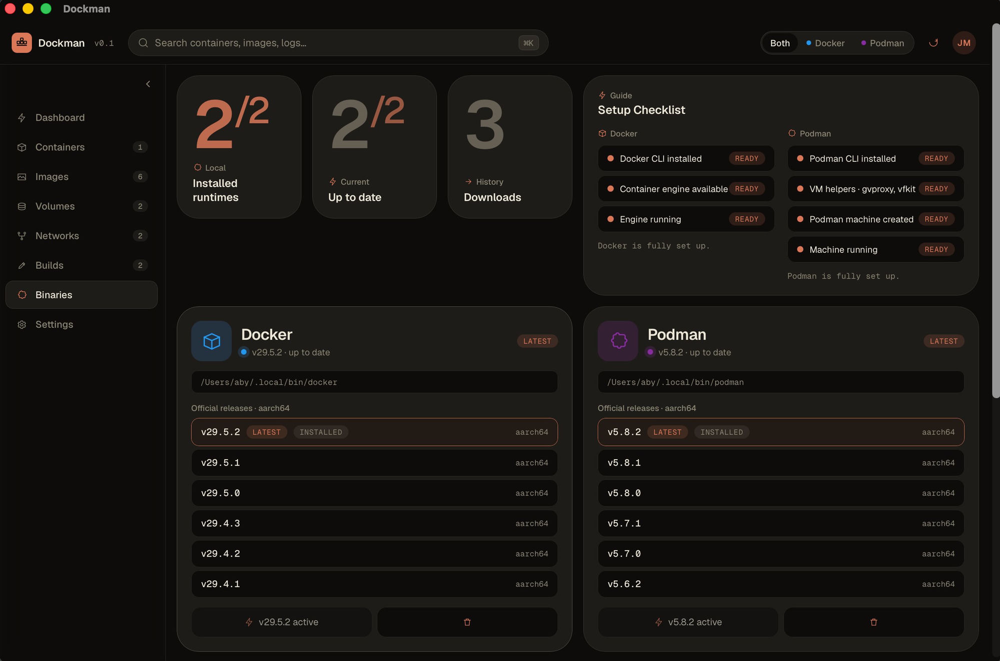<br><sub><b>Binaries</b></sub></td>
    <td align="center">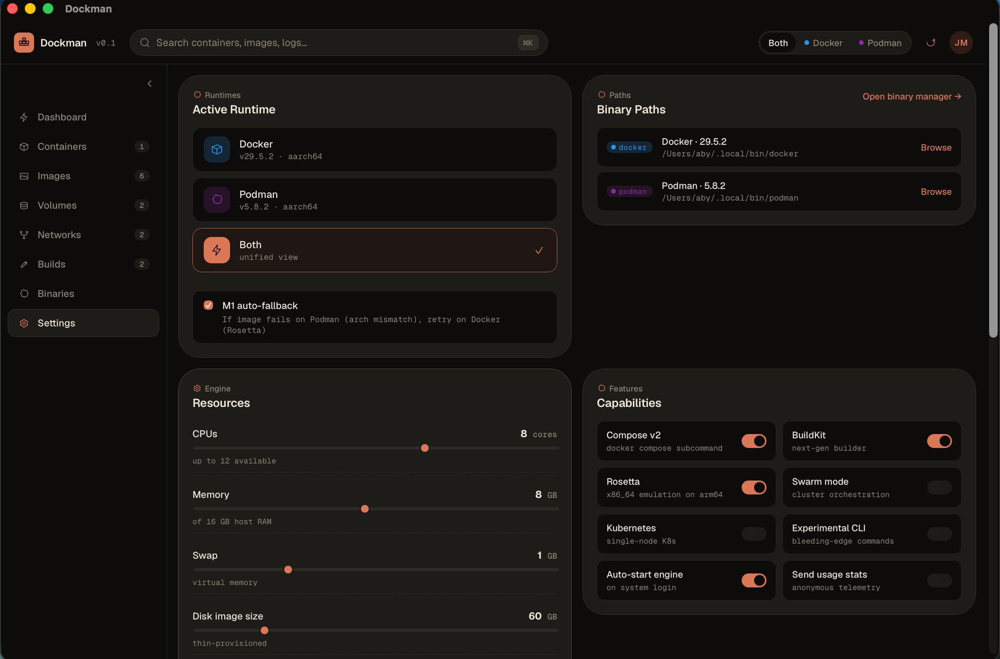<br><sub><b>Settings</b></sub></td>
  </tr>
</table>

</div>

<a id="development"></a>

## 🛠️ Development

**Prerequisites**

- [Node.js](https://nodejs.org) 20 or newer
- [Rust](https://rustup.rs) (stable toolchain)
- Tauri's platform dependencies — see the [Tauri prerequisites guide](https://tauri.app/start/prerequisites/)

**Run in development mode**

```bash
npm install
npm run tauri dev
```

## 🏗️ Building from source

```bash
npm run tauri build
```

The installer for your platform is written to `src-tauri/target/release/bundle/`.

<a id="releasing"></a>

## 🚀 Releasing

Releases are built and published automatically by GitHub Actions ([`.github/workflows/release.yml`](.github/workflows/release.yml)). To cut one:

```bash
make release VERSION=0.2.0
```

This bumps the version across `package.json`, `src-tauri/Cargo.toml` and `src-tauri/tauri.conf.json`, commits the bump, tags `v0.2.0` and pushes. The pushed tag triggers the workflow, which builds every platform and creates a **draft GitHub Release** — review it and click **Publish**.

Run `make help` to list all commands.

## 🧱 Tech stack

- 🦀 &nbsp;**[Tauri 2](https://tauri.app)** — native desktop shell (Rust)
- ⚛️ &nbsp;**React 18 + TypeScript** — user interface
- ⚡ &nbsp;**Vite** — build tooling
- 🐻 &nbsp;**Zustand** — state management
- 🐳 &nbsp;The **Docker** and **Podman** CLIs — driven under the hood

## 🤝 Contributing

Dockman is early, and contributions are welcome — bug reports, feature ideas and pull requests all help. Open an [issue](https://github.com/AbyAbyss/dockman/issues) to start a discussion.

## 📄 License

[MIT](LICENSE) © [AbyAbyss](https://github.com/AbyAbyss)

<p align="center">
  <sub>Built with 🦀 Tauri and ⚛️ React · Free &amp; open source · Made by <a href="https://github.com/AbyAbyss">AbyAbyss</a></sub>
</p>
